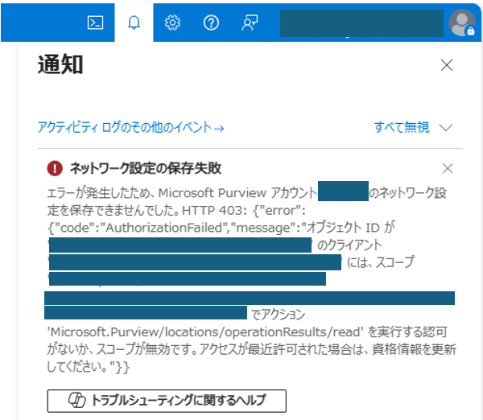

この記事では Purviewアカウントのネットワーク設定の変更の際に表示されるエラーについてご説明します。

<!-- more -->

## 概要

Purviewアカウントのネットワーク設定の変更の際に、以下のエラーが表示される事象が発生します。

## 現象
概要でご説明した事象が発生する手順は次の通りです。

1. AzureポータルからAzureサービス「Microsoft Purview アカウント」を選択します。
2. ネットワーク設定をしたい Purviewアカウントを選択します。
3. 左タブの 設定 > ネットワークを開きます。
4. ネットワーク設定を変更し、保存ボタンを押します。
5. 概要に掲載しているエラーが右上の通知部分に表示されます。

## 解決法

「Microsoft Purview アカウントをホストする Azure サブスクリプションに IAM 閲覧者ロール」の権限が付与されているかご確認ください。
> [!TIP]
> Azure Resource Managerで設定の状況を追跡をするため、上記の権限が必要になります。

Purviewアカウントのネットワーク設定の際に必要な権限・情報は以下の公開情報にもまとめられております。
[Microsoft Purview アカウントのファイアウォール設定を構成する](https://learn.microsoft.com/ja-jp/purview/catalog-firewall)

